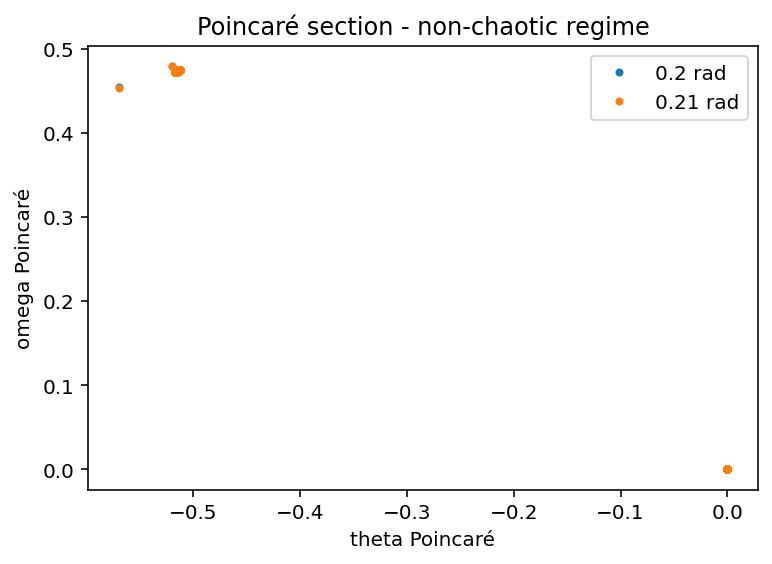
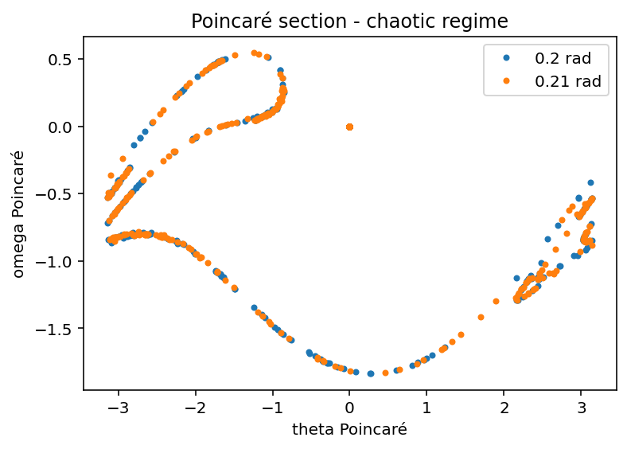

# Chaotic Pendulum – Driven Damped Dynamics

## Overview

This project simulates a driven damped pendulum to compare chaotic and non-chaotic regimes.

The system is integrated using the Euler-Cromer method, highlighting how small differences in initial conditions can lead to significantly different long-term behaviour.

---

## Model & Method
- Driven damped pendulum  
- External periodic driving force  
- Damping term  
- Euler-Cromer time integration  
- Time evolution and phase space analysis  
- Poincaré sections for long-time behaviour  
- Lyapunov exponent estimation from nearby trajectories  

---

## Results

### Poincaré section – non-chaotic regime



### Poincaré section – chaotic regime



The results highlight the transition from regular motion to chaotic behaviour.

## How to run

Run the script:

```bash
python chaotic_pendulum.py
```

By default, the script runs:

* Case 2 → Poincaré section

To explore other simulations, enable interactive mode:

```python
main(mode="interactive")
```

Available cases:

* Short-time dynamics and phase space
* Long-time Poincaré section
* Lyapunov exponent estimate

---

## Notes
* Time step: 0.01
* The same numerical method is used to compare chaotic and non-chaotic regimes
